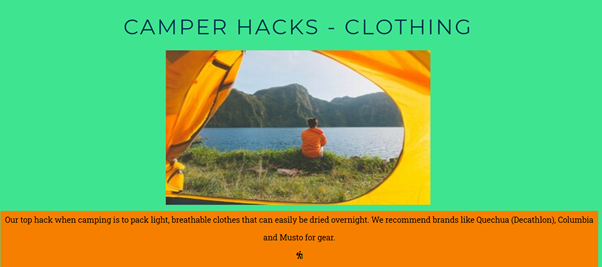
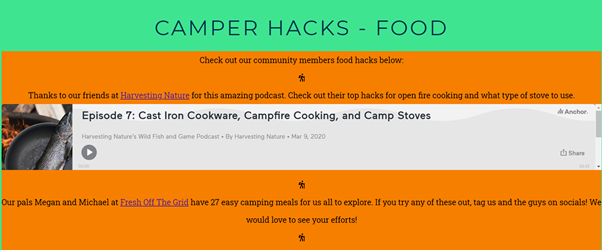

<h1 align="center">Camper Hacks Website</h1>

[View 'Camper Hacks' live website here.](https://lonesg.github.io/camperhacks/)

"Camper Hacks" offers camping hacks, tips and tricks for motorhome, campervan and wild camping fans. 
Users will be greeted with an abundance of practical camping tips and tricks to make their trips more enjoyable!

"Camper Hacks" also offers users the opportunity to join it's wider community through a sign up form. Signing up will give the user access to the monthly newsletter which includes details of meet ups for the community members.
This website is designed to be responsive and accessible on a range of devices, ensuring those on the road can access these tips while camping.


## Contents
<ul>
    <li>
        <a href="#User Experience (UX)"><strong>User Experience (UX)</strong></a>               
    </li>
    <li>
        <a href="#Features"><strong>Features</strong></a>
    </li>
    <li>
        <a href="#Technologies"><strong>Technologies</strong></a>   
    </li>
    <li>
        <a href="#Testing"><strong>Testing</strong></a>
    </li>
    <li>
        <a href="#Deployment"><strong>Deployment</strong></a>
    </li>
    <li>
       <a href="#Credits"><strong>Credits</strong></a> 
    </li>
</ul>
<hr>


# User Experience (UX)
- ## Strategy

- ### Vision
    Camper Hacks is a specialist website aiming to provide tips, tricks and hacks for camping enthusiasts and to bring these people together in an online and real world community setting. Having just converted a commercial van to a campervan  myself, I felt there was a gap in the market online for people like myself. It's nice to meet like minded people when camping so this website seeks to link the camping community together, particularly around Ireland.
    I want this website to offer a sense of community to the user. I want it to be engaging and to encourage the user to get involved in realtime by signing up to the community newsletter, attending meet ups and using the tips and tricks provided.

- ### Aims
    To give camping enthusiasts an outlet for camping tips, tricks and hacks.
    To give camping enthusiasts the opportunity to make connections with like minded members of the camping community.
    To constantly update the website with new and fresh ideas, photos of meet ups and relevant content.

- ### Target Audience
    There are a number of target audiences for this website due to the fact that camping is for everyone. We welcome new and old members from all age ranges and all locations.
    Camper Hacks meet ups will happen mostly in Ireland, so in that regard,  this website will be mostly targeting Irish campers.


- ### User stories

    -   #### First Time Visitor Goals

        1. As a First Time Visitor, I want to easily gain some tips or tricks to make my camping experiences more enjoyable.
        2. As a First Time Visitor, I want to be able to easily navigate throughout the site to find content.
        
    -   #### Returning Visitor Goals

        1. As a Returning Visitor, I want to locate the relevant social media links to see what kind of community Camper Hacks is.
        2. As a Returning Visitor, I want to find how I can join this community, attend meet ups and avail of their newsletter.

    -   #### Frequent User Goals
        1. As a Frequent User, I want to find out the winners of the monthly cooking competition.
        2. As a Frequent User, I want to see newly updated information in each section.
<br>

- ## Scope
    - When creating this website I took an agile approach. That is, creating bite-size increments of development at any one time. I worked at the different sections in smaller chunks. I solved smaller parts of the problem by choosing small elements to work on daily. These smaller sprints of work allowed me to ensure the features I wanted to build were done in a timely fashion  and also that I didn't succumb to 'scope creep'.
    - I have met the functional requirements of the website by allowing the user the opportunity to sign up to the newsletter and to join the online community.
    - I have met the content requirement of the website by providing the users with the media they need in order to gain a better understanding of the community that Camper Hacks is offering to them as a new member.
    - I believe this website is useful for the user.

- ## Structure

    - I have chosen to create a website with multiple pages allowing me to separate the information into logical sections to make it easier for the user to find what they are looking for. The navigation bar at the top of all of the pages allows the user to easily navigate to the page of the website they are most interested in.
    - On the index.html page,  I chose to have the hero image first. This grabs the users attention instantly with vibrant colours. The "Who We Are" section comes next and I felt this was the proper placing for this information. Logically, a user will want to know what the website is about. Then the page is sub-divided into sections for Clothing, Gear and Food hacks. Logically, this made sense to me as they would be the top three things one would pack when camping. 
    - On the gallery.html page, I have included images of the previous meet ups and of photos users have sent in. These photos are presented in an organised manner. Personally, I like to see a gallery on websites when I am a first time user. To me, this page was necessary in order to build that sense of community.
    - On the signup.html page, I used the same colour scheme to give the user the sense of familiarity. To me, the sign up page would logically come at the end of the menu list on  the navbar. The user has viewed all other pages and now wants to join the community.
    - The thankyou.html page displays a welcome message to the user, welcoming them to the community and thanking them for signing up. This page also displays the familiar navigation bar so that the user can quickly go back to any section of the website.

- ## Skeleton

-  ### Wireframes

    - I made some very basic wireframes using Balsamiq at the beginning of the project. As a total beginner, I found Balsamiq very helpful. I didn't quite know what styling I wanted on my pages but I had a very clear picture about the content. I knew how many pages I wanted my website to have and had a clear image in my head.  Balsamiq allowed me to create a visual of my idea and gave me a goal to work towards.

    

    

- ## Surface

- ### Design
    -   #### Colour Scheme
        -   The main colours used in this project are Prussian Blue (#003049), Gold Drop (#f77f00), Saffron (##f4d023) and Shamrock (#3fe491).
        - The blue color reflects the open sky and fine weather. The golden colors, again represent the sun and warm weather that is much loved by campers. Finally, the aqua color represents water in nature.
        -   I made this pallete on iColorpalette.com. When I played around with the website, I didn't like the second color, Torch Red as I found it wasn't very easy on the eyes.      
                                    
        
    -   #### Typography
        -   The Roboto Slab font is the main font used throughout the body of the website with Sans Serif as the fallback font in case for any reason the font isn't being imported into the site correctly. Roboto Slab is a clean font used frequently. I have used Montserrat as the headings font. I used Google Fonts to compare and contrast a variety of font matches and I believe this pairing makes the website easy to use and accessible. 
    -   #### Imagery
        -   I have used a large striking image on the home page of the website. I wanted to capture the sense of adventure that camping enthusiasts enjoy. The imagery used throughout the website fits in nicely with the colour scheme and I believe there is a nice flow to the overall imagery on each page of the website.

   - #### Icons
        - I decided to use the Font Awesome icons. The icons that I chose fit in well with the overall theme of nature and exploring. The icons are styled in accordance with my website, with the same colors and fonts. 
<hr>

# Features

-  ### Existing Features
    - #### Navigation Bar
        -The navigation bar is featured on all pages. The fully responsive navigation  bar links to Home, Camper Hacks, Gallery and Sign Up pages. This navigation bar is repeated on all pages to allow the user to navigate the site easily.
        -Having the navigation bar the same on each page allows the user to use the website fluidly without having to make use of the 'back' bar when navigating between pages.

        

    - #### The Landing Page
        - The landing page contains a hero image that entices the user to use the page. The contrast between the image with mountains and snowy peaks and the background colour is intended to grab the users attention.

        

    - #### The 'Back to Top' link
        - The back to top link promotes positive user experiences on the website as it allows the user to scroll the website without having to manually go back up to the top to navigate their way around the site. 
        - Positive user experiences are key in keeping users engaged with the site so I wanted to add this feature.
        - I also took this opportunity to use the lighter yellow colour for the background of this feauture and the navy colour used elsewhere throughout the website for the text, as this colour combination  is easily spotted as its contrasts with the other colours. It is also helpful for users who may have dyslexia and visual impairment issues. This colour scheme is used for each link throughout the page to allow for familiarity, allowing the user to navigate back to the top with ease.

        

    - #### The Who We Are section
        - The who we are section introduces the user to the Camper Hacks community, it's founders and gives a brief introduction. It lets the user know what they will find on the page and how to acess information.

        

    - #### The Camper Hacks Section
        - This section is sub divided into three specific headings; Clothing, Gear and Food. The user will find a wide variety of tips and tricks, presented through the medium of text, video, imagery and links to external websites. 

        
        
        

    - #### The Footer
        - This section provides the user with links to the Camper Hacks social media accounts, Facebook, Instagram, Twitter and Youtube.
        These links open in a new window, allowing the user to remain on the Camper Hacks website also. 
        - The footer further establishes the sense of community by showing the user examples of the community and past events.

        

    - #### Gallery

        - The gallery gives the user the chance to browse images to see what kind of community events have happened in the past.
        - The gallery allows the user to build a sense of understanding for what type of people are involved and where in their locality past meet-ups have been held.

        

    - #### Sign Up Page

        - The sign up page gives the user the chance to sign up to the monthly newsletter through a form. The user will provide their first and last name, email address, and choose from a choice of three types of camping they prefer. 

        

        - The sign up page button also has a hover effect and pointer cursor for ease of use. The user can clearly identify the sign up button as it is highlighted in yellow and the pointer changes to draw attention to this area.

        
    - #### Thank You Page

        - The thank you page confirms the user has successfully signed up and welcomes them to the community. 

        
 
 -  ### Features Left to Implement
    - #### 'Contact Us' page
        - I think  another feature that could allow for another positive user experience is the addition of another page for "Contact Us". Here the users can submit their own  camper hacks which can then be used to update the site regularly.

    - #### Responsive on all device sizes 
        - The website is responsive on a number of devices at different screen widths. 
<hr>

# Technologies
- ## Languages Used

    -   [HTML5](https://en.wikipedia.org/wiki/HTML5)
    -   [CSS3](https://en.wikipedia.org/wiki/Cascading_Style_Sheets)

- ## Frameworks, Libraries & Programs Used

    1. [Pexels:](https://pexels.com/)
    - I used Pexels throughout my website for all imagery used. Pexels offers Copyright free imagery. All images used were chosen as they fit the overall theme for the website.
    1. [Google Fonts:](https://fonts.google.com/)
    - Google fonts were used to import the 'Roboto Slab' and 'Montserrat' fonts into the style.css file which is used on all pages throughout the project.
    1. [Font Awesome:](https://fontawesome.com/)
    - Font Awesome was used on all pages throughout the website to add icons for aesthetic and UX purposes. These were inkeeping with the overall style of the website.
    1. [GitHub:](https://github.com/)
    - GitHub is used to store the projects code after being pushed from Git.
    1. [Balsamiq:](https://balsamiq.com/)
    - Balsamiq was used to create my wireframes during the design process.
<hr>

 # Testing

### Initial Testing

-   The website was tested on Google Chrome, Internet Explorer and Safari browsers.
-   The website was viewed on a variety of devices such as Desktop, Laptop, iPhone7, iPhone 8 & iPhone 11.
-   Testing was completed to ensure that all pages were linking correctly from the navigation bar.
-   I tested to ensure the Sign Up form is validated and requires all fields to be filled before submitting is allowed.
-   Friends and family members were asked to review the site and documentation to point out any bugs and/or user experience issues.

### Further Testing 

 - The W3C Markup Validator and W3C CSS Validator Services were used to validate every page of the project to ensure there were no syntax errors in the project.

-   [W3C Markup Validator](https://validator.w3.org/) No errors found:

    
    

-   [W3C CSS Validator](https://jigsaw.w3.org/css-validator/) No errors found:
    
    

-   I used Lighthouse Dev Tools to test my website:

    
    

### Testing User Stories from User Experience (UX) Section

-   #### First Time Visitor Goals

    1. As a First Time Visitor, I want to easily gain some tips or tricks to make my camping experiences more enjoyable.

        1. When a user lands on the homepage of the website, users are automatically greeted with the navigation bar. The options on the navigation bar are clearly labelled for users, providing direction to other parts of the website which offer tips and tricks, sign up options and a gallery. Underneath the navigation bar there is a hero image which gives the user a sense of what the page is about.
        2. Underneath the hero image, there is a brief introduction to "Camper Hacks", defining the purpose of the page and introducing the community aspect on offer to users also. 
        3. The user has the option then to scroll down to learn some tips and tricks, under the headings Clothes, Gear and Food.

    2. As a First Time Visitor, I want to be able to easily be able to navigate throughout the site to find content.

        1. The site has been designed with ease in mind. The user can access all pages from the navigation bar. On each  page, the navigation bar remains the same, allowing the user to develop a familiarity with the layout. The pages on the navigation bar are clearly labelled so that the user knows exactly what information they will find upon clicking the link to open a new page. 
        2. On the Sign Up Page, after a form response is submitted, a "Thank You" page will load. This brings the user to another page welcoming them to the community. Again, this page is designed in the same way as the rest of the site, allowing the user to navigate away from the page and back to another section of their choice.

-   #### Returning Visitor Goals

    1. As a Returning Visitor, I want to locate the relevant social media links to see what kind of community Camper Hacks is.

        1. The relevant social media links are clearly shown in the footer.
        2. When  the user clicks on the social media links, the new page will open in a new window.  This allows the user to stay on the current page and not be drawn away from the Camper Hacks site.

    2. As a Returning Visitor, I want to find how I can join this community, attend meet ups and avail of their newsletter.

        1. The navigation bar clearly highlights the "Sign Up" page.
        2. Here, the users can fill out the form with their first name, last name, email and type of camping they take part in. The user is informed that signing up will subscribe them to the Camper Hacks Newsletter, which will then be emailed to them. In the newsletter, they will find details of meet ups. 
        3. On the Sign Up page, there is a "Sign Me Up!" button directly under the form which can be easily found.
     
-   #### Frequent User Goals

    1. As a Frequent User, I want to find out the winners of the monthly cooking competition.
        1. The user would already be comfortable with the website layout and can navigate to the food section to find the winner.
        The winning recipe is also emailed in the newsletter each month. This is stated in the Food section for users to see.

    2. As a Frequent User, I want to see newly updated information in each section.

        1. The user would already be comfortable with the website layout and can easily check each section for new and updated hacks.

    
### Known Bugs

-   On some devices, I noticed the iframe holding the podcast in the Camper Hacks - Food section was stretching out to take up too much space and causing overflow, particularly on small devices. I chose to take the width and height values out of the iframe itself and size the iframe using CSS. This has fixed the bug on small devices.
- I had some issues initially when I ran my code through the validator around h1 headings. I had used these in more than one place in my files. I subsequently changed the h1's to h2 or h3 headings. 
- I noticed when testing the website with Lighthouse that my own internet connection affected the websites Performance score. When testing in different places,  the score ranged +/- 5 points. I found this interesting and read some articles about Lighthouse which I found helpful. View the  [Lighthouse Article](https://requestmetrics.com/web-performance/the-limitations-of-lighthouse) here.

<hr>

# Deployment

### GitHub Pages

The project was deployed to GitHub Pages using the following steps:

1. Log in to GitHub and locate the [GitHub Repository](https://github.com/)
2. At the top of the Repository, locate the "Settings" Button on the menu.
3. Scroll down the Settings page until you locate the "GitHub Pages" Section.
4. Once at this section, it says "Pages settings now has its own dedicated tab! Check it out here!" Click on the link.
4. Under "Source", click the dropdown called "None" and select "Master Branch".
5. The page will automatically refresh.
6. Scroll back down through the page to locate the now published site [Camper Hacks link](https://lonesg.github.io/camperhacks/) in the "GitHub Pages" section.

### Forking the GitHub Repository

By forking the GitHub Repository we make a copy of the original repository on our GitHub account to view and/or make changes without affecting the original repository by using the following steps...

1. Log in to GitHub and locate the [GitHub Repository](https://github.com/)
2. At the top of the Repository (not top of page) just above the "Settings" Button on the menu, locate the "Fork" Button.
3. You should now have a copy of the original repository in your GitHub account.

### Making a Local Clone

1. Log in to GitHub and locate the [GitHub Repository](https://github.com/)
2. Under the repository name, click "Clone or download".
3. To clone the repository using HTTPS, under "Clone with HTTPS", copy the link.
4. Open Git Bash
5. Change the current working directory to the location where you want the cloned directory to be made.
6. Type `git clone`, and then paste the URL you copied in Step 3.

```
$ git clone https://github.com/LonesG/camperhacks
```

7. Press Enter. Your local clone will be created.

```
$ git clone https://github.com/LonesG/camperhacks
>Cloning into 'portfolio-one'...
>remote: Enumerating objects: 287, done.
>remote: Counting objects: 100% (287/287), done.
>remote: Compressing objects: 100% (189/189), done.
>remote: Total 287 (delta 136), reused 220 (delta 72), pack-reused 0
>Receiving objects: 100% (287/287), 26.52 MiB | 11.73 MiB/s, done.
>Resolving deltas: 100% (136/136), done
```

<hr>

# Credits

### Content

-   All content was written by Leona Griffin

-  The overall structure of  the Gallery page is similar to the "Love Running" Gallery page. I have styled it in my own way to suit the overall design of my website.

### Media

-   All Images were taken from Pexels.

### Acknowledgements

-   My Mentor Gerry McBride for continuous helpful feedback.

-   Tutor support at Code Institute for their support.

-   My family and friends for testing the website. 